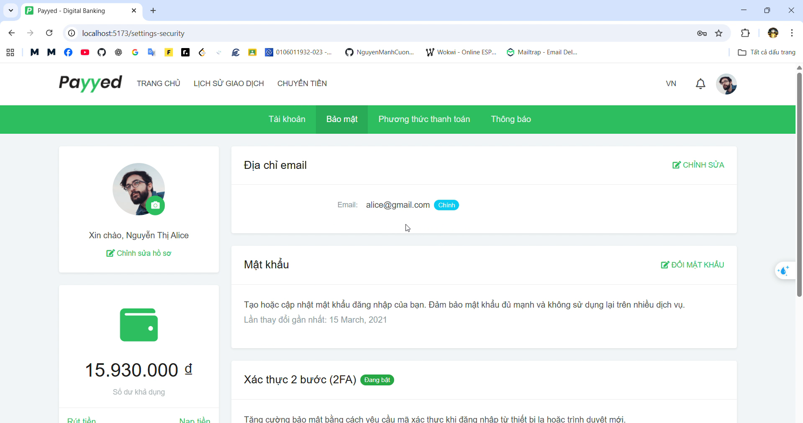
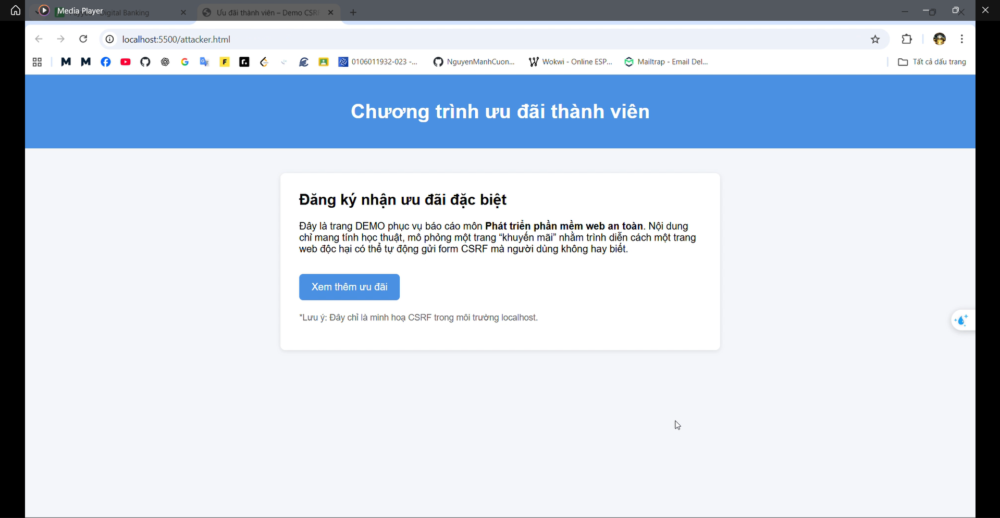
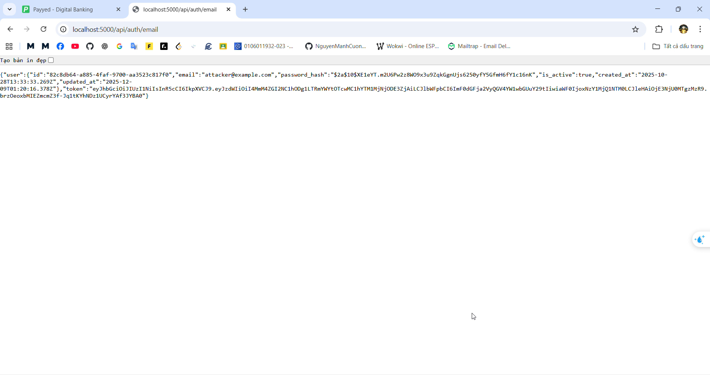
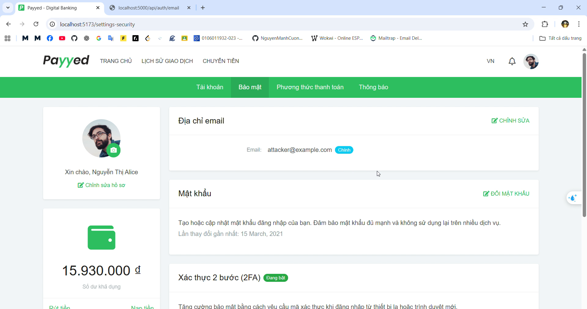
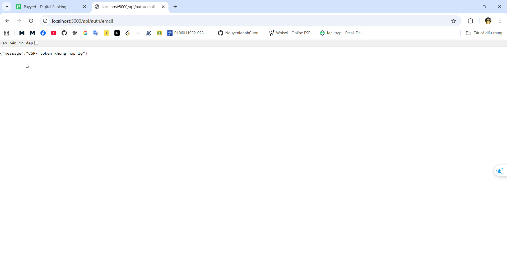

# CSRF Protection -- Demo tấn công CSRF và cách phòng chống

Dự án phục vụ môn học **Phát triển phần mềm web an toàn**

## Danh sách thành viên nhóm và phân chia công việc

Nguyễn Tùng Lâm - 22810310371 - Chuẩn bị trang web dễ bị tấn công

Nguyễn Gia Quang - 22810310438 - Thực hiện tấn công CSRF

Nguyễn Trung Hữu - 22810310367 - Khắc phục và bảo vệ trang web bằng CSRF token + samesite cookies

## 📌 Giới thiệu

Dự án minh họa cách một ứng dụng web dễ bị **Cross-Site Request Forgery
(CSRF)** khi không có biện pháp bảo vệ, cũng như cách khắc phục bằng:

-   **CSRF Token**\
-   **SameSite Cookies**\
-   **Kiểm tra header / cookie trùng khớp**\
-   **Session-based Auth thay cho token trong localStorage**

Project bao gồm:\
1. **Backend (Node.js + Express)**\ linkgit: https://github.com/NguyenGiaQuang/Payyed
2. **Frontend (Vite + React hoặc Vanilla)**\ 
3. **Trang attacker.html** mô phỏng trang độc hại auto-submit form CSRF.

------------------------------------------------------------------------

## 🏗 Cấu trúc dự án

    /project
    │── backend
    │   ├── server.js
    │   ├── routes/
    │   ├── middleware/csrfProtection.js
    │   ├── controllers/
    │   └── ...
    │
    │── frontend
    │   ├── index.html
    │   ├── src/
    │   └── ...
    │
    └── attacker
        └── attacker.html

------------------------------------------------------------------------

## 🚀 Cài đặt & Chạy dự án

### 1️⃣ Cài đặt backend

``` bash
cd backend
npm install
npm run dev
```

Backend mặc định chạy tại:\
👉 **http://localhost:5000**

------------------------------------------------------------------------

### 2️⃣ Cài đặt frontend

``` bash
cd frontend
npm install
npm run dev
```

Frontend mặc định chạy tại:\
👉 **http://localhost:5173**

------------------------------------------------------------------------

### 3️⃣ Chạy trang attacker

Mở file:

    attacker/attacker.html

bằng trình duyệt, hoặc dùng live server (VSCode).

------------------------------------------------------------------------

## 🔥 Demo tấn công CSRF

### 🧪 1. Khi CSRF chưa được bảo vệ

-   Attacker tạo form ẩn:

    ``` html
    <form action="http://localhost:5000/api/auth/change-email" method="POST">
      <input type="hidden" name="new_email" value="attacker@example.com">
    </form>
    ```

-   Sau 2 giây, script tự động submit → email của nạn nhân bị đổi\

-   Điều kiện: nạn nhân đang đăng nhập, cookie session vẫn hợp lệ

------------------------------------------------------------------------

## 🛡 Demo fix CSRF

### 🛑 1. Thêm middleware kiểm tra CSRF token

``` js
import createError from 'http-errors';

export function csrfProtection(req, res, next) {
    const method = req.method.toUpperCase();
    const safe = ['GET', 'HEAD', 'OPTIONS'];
    if (safe.includes(method)) return next();

    const csrfCookie = req.cookies?.csrf_token;
    const csrfHeader = req.headers['x-csrf-token'] || req.body?._csrf;

    if (!csrfCookie || !csrfHeader || csrfCookie !== csrfHeader) {
        return next(createError(403, 'CSRF token không hợp lệ'));
    }

    next();
}
```

### 🧠 Giải thích nhanh:

-   Cookie `csrf_token` → được server gửi về\
-   Header `x-csrf-token` hoặc `_csrf` trong body → được client gửi lên\
-   Hai giá trị phải **trùng nhau**\
-   Attacker không đọc được cookie → không gửi token hợp lệ

------------------------------------------------------------------------

## 🔐 Một số API quan trọng

  API                        Method   Middleware       Mô tả
  -------------------------- -------- ---------------- --------------
  `/api/auth/login`          POST     \-               Đăng nhập
  `/api/auth/logout`         POST     csrfProtection   Đăng xuất
  `/api/auth/change-email`   PATCH    csrfProtection   Đổi email
  `/api/auth/password`       PATCH    csrfProtection   Đổi mật khẩu

------------------------------------------------------------------------

## 📘 Yêu cầu môi trường

-   Node.js ≥ 18\
-   NPM ≥ 9\
-   Browser hỗ trợ SameSite cookies

------------------------------------------------------------------------

## Kết quả demo
Email lúc chưa bị tấn công


Người dùng mở trang web khả nghi


Trang web gửi form ẩn thực hiện tấn công csrf


Email đã bị thay đổi


Sau khi thực hiện các biện pháp bảo vệ, không cho phép thực hiện các request trái phép nữa


## Video demo toàn bộ

https://drive.google.com/file/d/1izts0QszNgNY1Aqx2VUjUfYRNLqplWGe/view?usp=sharing

## 🏁 Kết luận

Dự án giúp hiểu rõ:\
- Cơ chế CSRF\
- Cách token + SameSite bảo vệ hệ thống\
- Minh họa tấn công + phòng thủ rõ ràng

